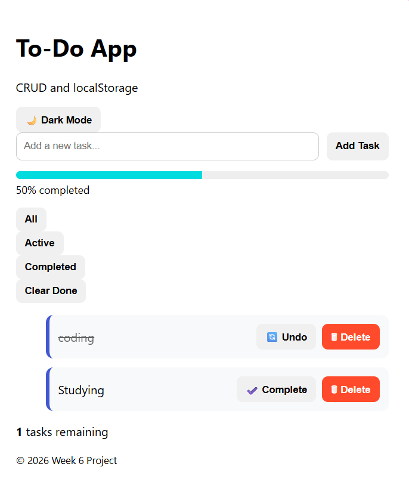

# Week 6 – To-Do App (CRUD + localStorage)

Author: **Eva Tsatsi**

---

## Overview

This project is a **JavaScript To-Do Application** built to demonstrate **CRUD operations, DOM manipulation, and data persistence using localStorage**.

Users can create tasks, manage their completion status, filter tasks based on their state, and store all data locally in the browser so tasks remain available after refreshing the page.

The project also includes several **UI and usability enhancements** to create a more polished and interactive experience.

---

## Objective

Build a To-Do application that supports:

* Add tasks
* Toggle task completion
* Delete tasks
* Filter tasks *(All / Active / Completed)*
* Persist data using **localStorage**

---

## Features

### Core Requirements (Assignment Rubric)

✔ Add new tasks
✔ Toggle task completion
✔ Delete tasks
✔ Filter tasks *(All / Active / Completed)*
✔ Persist tasks using **localStorage**
✔ Event handling and **DOM manipulation**
✔ Responsive layout for mobile devices

---

### Additional Enhancements

✔ Inline task editing
✔ Progress bar showing percentage of completed tasks
✔ Clear completed tasks
✔ Dark mode toggle
✔ Emoji + text action buttons for better usability

---

## Technologies Used

* **HTML5** – Application structure
* **CSS3** – Styling and responsive layout
* **JavaScript (ES6)** – Application logic
* **localStorage API** – Data persistence in the browser

---

## Key Concepts Practiced

This project demonstrates several important front-end development concepts:

* DOM selection and manipulation
* Event handling and event delegation
* Array methods such as `map()` and `filter()`
* State management in JavaScript
* Client-side data persistence with `localStorage`
* Responsive UI design
* User experience enhancements

---

## Application Workflow

1. Users enter a task in the input field and click **Add Task**.
2. The task is stored in a JavaScript array representing the application state.
3. The array is saved to **localStorage** so tasks remain available after a page refresh.
4. Tasks can be:

   * Marked as **complete**
   * **Deleted**
   * **Edited inline**
5. Filter buttons allow viewing:

   * All tasks
   * Active tasks
   * Completed tasks
6. A **progress bar** updates dynamically to show completion percentage.

---

## Project Structure

```
todo-app
│
├── index.html
│
├── assets
│   ├── css
│   │   └── style.css
│   │____images __screenshot
│   └── js
│       └── app.js
│
└── README.me
```

---

## Learning Reflection

This project strengthened my understanding of:

* Managing application state in JavaScript
* Persisting data using browser storage
* Implementing CRUD functionality
* Structuring front-end projects
* Improving user experience through interactive UI features

---
 ## Screenshot



## Author

**Eva Tsatsi**

Full Stack Development Student

